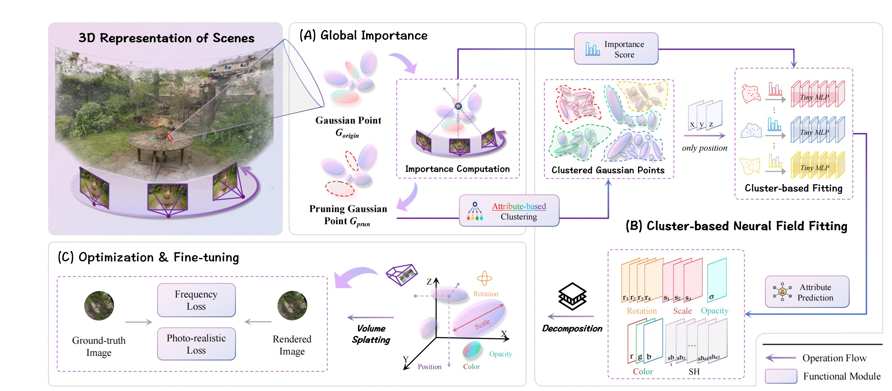
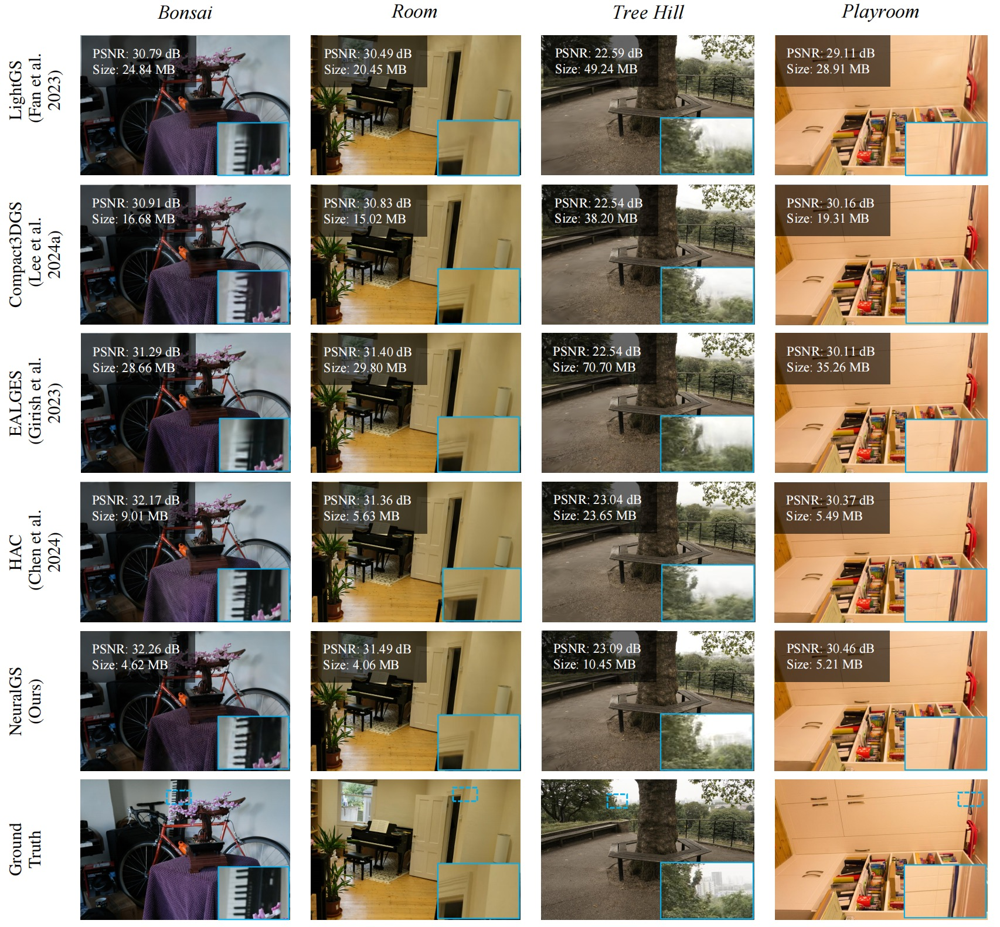
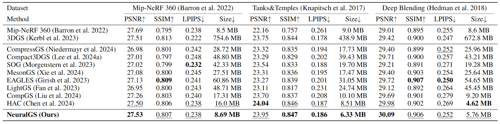
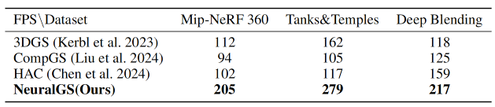
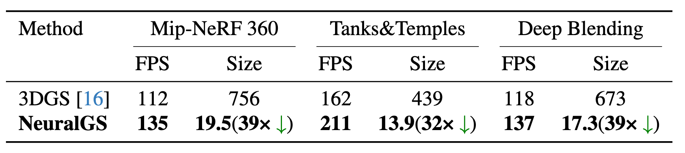
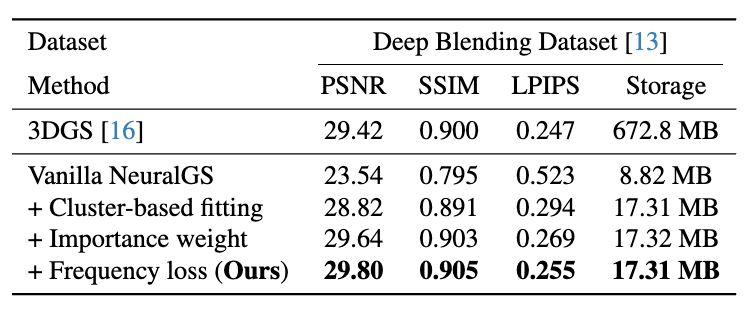

<h2 align="center"> 
  <a href="https://github.com/PKU-YuanGroup/NeuralGS"> NeuralGS: Bridging Neural Fields and 3D Gaussian Splatting for Compact 3D Representation</a>
</h2>
<h5 align="center"> 
If you like our project, please give us a star ⭐ on GitHub for latest update.  </h5>
<h5 align="center">

[](https://arxiv.org/abs/2503.23162)
[](https://github.com/PKU-YuanGroup/NeuralGS/blob/main/LICENSE) 
[](https://github.com/PKU-YuanGroup/NeuralGS/stargazers)&#160;
[](https://github.com/PKU-YuanGroup/NeuralGS/network)&#160;
[](https://github.com/PKU-YuanGroup/NeuralGS/watchers)&#160;


</h5>Implemetation of Bridging Neural Fields and 3D Gaussian Splatting for Compact 3D Representation.


## 🗓️ TODO
We will update the following list after the paper is accepted.
- [x] [2025-02-07] We have released our [project page](https://pku-yuangroup.github.io/NeuralGS).
- [x] We have uploaded our paper, NeuralGS on [arXiv](https://arxiv.org/abs/2503.23162).
- [ ] Upload the code

## 🍭 Novel Synthesis Results
### 🌅 Qualitative comparison


### 📊 Quantitative comparison


<div class="is-centered">
    <figure style="text-align: center;">
        <figcaption style="text-align: center; margin-top: 0.5rem;"> Table 1. Quantitative results evaluated on <em>Mip-NeRF 360, Tanks&Temples, and Deep Blending</em> datasets. We highlight the best-performing results in <strong>bold</strong> and the second-best results in <u>underline</u> for all compression methods. </figcaption>
        
    </figure>
</div>
<div class="is-centered">
    <figure style="text-align: center;">
        <figcaption style="text-align: center; margin-top: 0.5rem;"> Table 2. Comparison of the rendering speed(FPS↑). The rendering speed of all methods is measured on our machine. </figcaption>
        
    </figure>
</div>

<!--  -->
<!-- 

 -->


<!-- <h2>
  
  Acknowledgements
</h2> -->
## 🙏 Acknowledgements

This source code is derived from multiple sources, in particular: 
[gaussian-splatting](https://github.com/graphdeco-inria/gaussian-splatting/tree/main). We thank the authors for releasing their code.

```bibtex

To be contunied...

```

## 🤝 Contributors

<a href="https://github.com/PKU-YuanGroup/NeuralGS/graphs/contributors">
  
</a>
